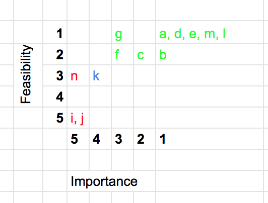
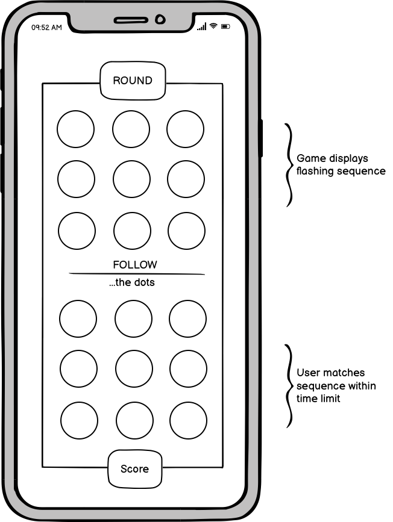
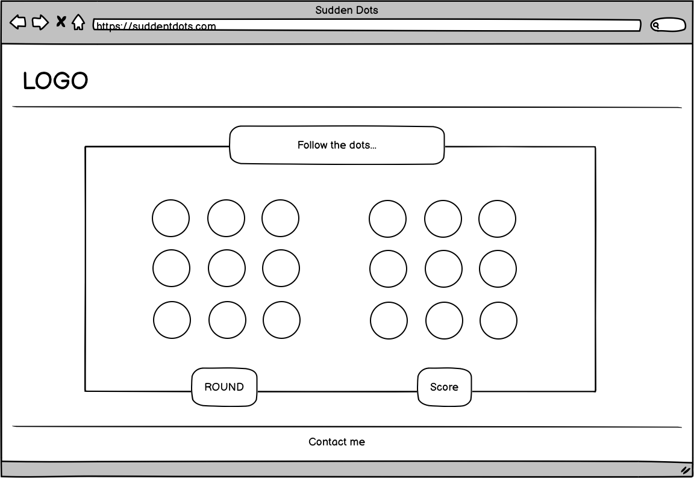
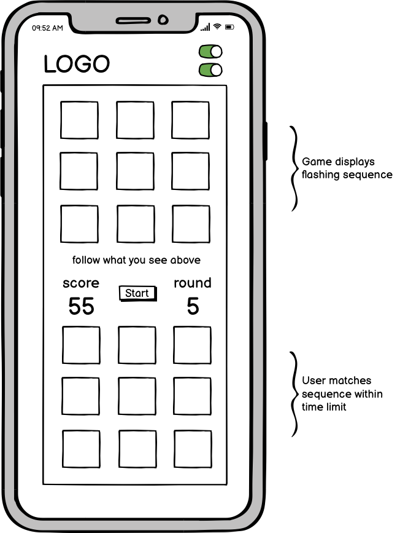
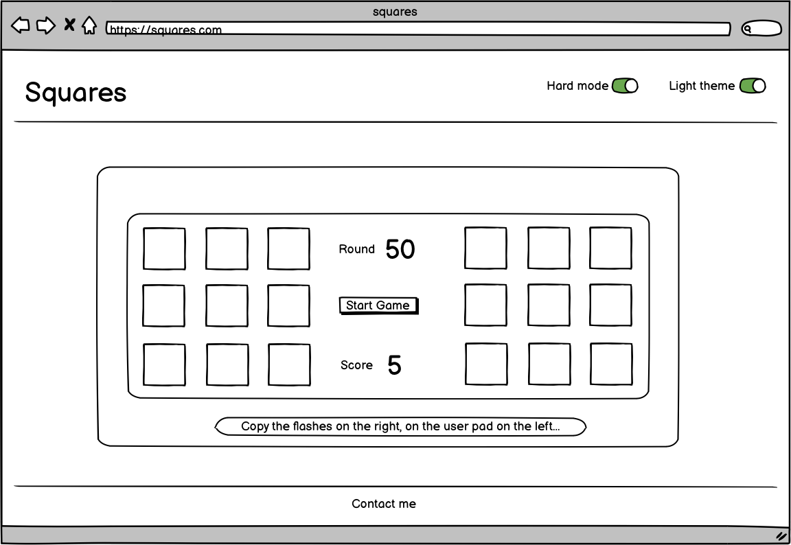

Milestone 2 project

# UX Considerations
## **STRATEGY**

The purpose of this project is to create a fun and accessible game. The primary intended user — or player — is a smartphone user looking to occupy themselves in those moments in the day in 
which we have a few snatched minutes to kill.  
The quantifiable value to the owner of any game app would be in the potential to attract advertising were it to become a popular game, thereby bringing in income and funding further projects. 
In this specific case, being a first-time builder of a Javascript game, its value is less quantifiable, but no less valid: constructing a basic game in Javascript gives me invaluable experience 
of coding and a base from which I can develop more complicated games and apps that are outside of the scope of this project.

### **User Stories**

* "As a working 25-year old I spend a lot of time on public transport... or waiting for it to turn up. I'd like something to occupy me whilst I do that. As such it shouldn't be too challenging, but I get bored easily, so I'd like to choose how hard to make it!"

* "As a parent of teenagers, I spend a lot my time running errands; waiting outside their friends' houses to pick them up, for example. I always have my phone with me, so something I can do while I'm waiting would be great! I'm usually in the car and it's usually late, so please don't make it too blinding to look at!"

* "As a young teen with a smartphone I'm looking for ways to avoid questions from my parents, and games that I can load instantly are a good way to look busy. It definitely shouldn't be too obvious that I'm playing a game, so sounds that I can't control are a no-no!"

* "I eat lunch at my desk, and I'm terrible at crosswords, so I tend to play low-commitment games on my computer while I eat."

Essentially, this game aims to be a five-minute boredom-buster. As the user stories illustrate, there are many situations in everyday life that call for a few moments of mindless escapism 
— queuing at the Post Office, for example — and this project aims to meet that need. It should be extremely quick to load, effortless to learn, and with a difficulty increase that does not frustrate, while still offering a developing level of challenge.

Above all it should be designed with a mobile-first approach. It will, of course, be playable by iPad and laptop/desktop users, but it is expected that game play will be overwhelmingly via handheld devices in the situations outlined above.

There are a great many competitors in the market, of course, the most obvious among them being Two Dots:

### **Two Dots**

An addictive puzzle game, Two Dots requires the player to match adjacent sequences of coloured dots to clear them from the board and meet a round-specific challenge. It's extremely accesible, with a gentle learning curve that offers quick-to-access gameplay. 
However, as you progress, it does become significantly more challenging and strategy-based, making it less suitable for 5-minute, ad-hoc gameplay. If I had to say anything negative about this game, it would be that, over time, the developers have added more 
and more pre-game distraction, which you are forced to interact with before you are able to access any game-play. For example, bonus games and offers; none of this are you forced to participate in, but considerable interaction is required simply to cancel these features.

## **SCOPE**

My project does not aim to compete with the type of established app mentioned above, which offers significant and deep levels of game-play, building on years of development. The aim with this project is to create a simple puzzle game which could form the basis of a 
far larger development project in future. My game will work well, entertain the user, give the user what they're looking for (easy and quick access to simple game-play), be simple to interact with and visually appealling. The feature list will therefore necessarily 
be far more conservative than a website project:

### **Possible game features**

|  | Feature | Feasibility | Importance
----|---|------------------|---------
| a | Simply puzzle game | 1 | 1
| b | Progression through levels based on success, with increasing difficulty | 2 | 2
| c | Top-score storage/player-acheivement memory | 2 | 2
| d | Touchscreen interactivity | 1 | 1
| e | Desktop (mouse/trackpad) interactivity | 1 | 1
| f | Desktop (keyboard) interactivity | 2 | 3
| g | Level-dependent design elements | 1 | 3
| h | Global scoreboard | 5 | 5
| i | Interaction with other players | 5 | 5
| j | Live multiplayer challenges | 5 | 5
| k | Bonus rounds (dependent on level acheived, or seasonal) | 3 | 4

### **Site/homepage features**
| |Feature|Feasibility|Importance
|---|---|------------------|---------
| l | Developer contact information|1|1
| m | Header/footer|1|1
| n | Links to sister sites/games|3|5

We can see here that the majority of these features are important enough to be included in a first release or minimum viable product. On the surface that may seem excessive, but actually the majority of those features are aspects of the core game itself that are essential to satisfying game-play and would be expected by any user.

### *Mid-development feature review update, January 2021*
Having spent a significant amount of time developing the game I have reconsidered the feasibility of features 'f' and 'g'. 
Feature 'f' is keyboard interactivity for the desktop game. Building this into the game's functionality is eminently possible, but would unecessarily complicate my code at this stage. Reflecting on the fact this is is primarily intended to be a game played on a touchscreen device — the mobile-first approach — I have decided that it would be
acceptable to leave this feature to a future development stage.
Feature 'g' is, again, entirely possible, but is less critical to the MVP (minimum viable product) than other elements. It would certainly be fun to include and would be beneficial from a game-play perspective, but is, again, an added complication for a first release.

## **STRUCTURE**

To properly discuss the structure of this app we need to consider its basic functionality — essentially, the rules! Presented to the user are a selection of shapes (dots, squares or icons, for example). These flash in a random sequence and the user is required to match that sequence. In the early stages of the game there will be very few 'flashes', 
perhaps just starting with 2, and that will increase as game-play goes on. Multiple different parameters could be changed to affect game-play. For example, the number of flashes in a given sequence, the speed of the flashes and time between each, the visibility of the icons (or dots, squares) and the time given for the user to complete their sequence matching after the sequence of generated flashes has completed.

Given the simplicity of this game, and the aims of the app as a whole, the structure is similarly straightforward. It would be confusing and unecessary to add pages or multiple scrollable elements to the mobile or desktop site. The aim is to present the user with every available element in the one, initial view. 
Everything they need to interact with or to understand will be available to them on page load without further clicking or scrolling.

## **SKELETON**

### **Initial wireframes**

<!--  -->

The mobile version will take priority as this is far more likely to be played via this medium. Two layouts of shapes (in this case, dots!) will be presented on screen. The top will be the game display grid, and the lower grid will be for user input; for the player to match the sequence. 
Separating the game display from the user input grid has two advantages: 
- As the player rises through the levels, the number and speed of 'flashes' increases. This allows the user to match the sequence on their own grid while the top grid is still in the process of displaying the sequence to be matched above. 
This would not be necessary in early levels, but may become a necessary strategy as difficulty increases. Were there to be just one single grid, the user would be obscuring the still-displaying game sequence.
- A single grid would take up far more screen space. It is expected that a user will hold their device in one hand and input the sequence with their thumb. On a number of popular devices (the iPhone X and 'plus' versions of the 7 & 8, for example, plus a number of the larger-screened Android devices) 
it is not possible for the user to easily reach the upper portion of the screen with their thumb, without the risk of dropping the device. Indeed, 'reachability' is now a native feature of many touchscreen operating systems. A single, larger, game-play grid would suffer from the problems addressed by such 
reachability features, but it would neither be practical nor appropriate to attempt to implement such a feature in this game. A far better solution is to separate the game into a read-only grid at the top, and a user-input grid at the bottom, within easy reach of the player's thumb!

<!--  --->

The desktop version, as can be seen in the wireframe, converts to a landscape view, with the game grid on the left and the player grid on the right. This is far more appropriate a layout for a desktop or laptop screen and the left-right information flow makes sense to the likely Western userbase of the app.

### **Updated wireframes**

A few additions and changes were made to the structure of both mobile and desktop versions after initial development.
<!--  -->
  
<!--  -->

- The 'dots' became squares. This was a design decision and is discussed in greater detail in the Surface section.
- A start button and permanently displayed instructions were added. Initially the game started on page refresh, which was clunky UX, to say the least!
- Both versions were given a subtle header to display the game's name, rather than incorporating it into the design of the game grid container, which was becoming cluttered with the addition of the 
aforementioned instructional elements.

## **SURFACE**

I played with a few design ideas before settling on the final concept. I started with simple red-on-white circles — hence the working title 'Sudden Dots' — and even experimented with a grid of appearing and disappearing Fontawesome icons. 
Eventually, however, I took inspiration from music technology and based the design on the popular and iconic designs of MIDI controllers for digital audio workstations. Inspiration for this was taken from hardware such as Novation's Launchpad or Akai's control surfaces. 
The 'glow' you get from the pads worked well against the black background and the grid layout was precisely what was needed for this game.

I also liked the idea of capitalising on the simplicity of the game itself, and decided to embrace the '8-bit' nature of this through both the visual and auditory design.

### Novation Launchpad & Game Pad Design

<!--  -->
 

*Left: Novation Launchpad design. Right: Squares game pad design. The design of products such as Novation's Launchpad MIDI DAW controller heavily influenced my design and behaviour for the game pad.*

<!--  -->

Sounds: the implementation of sounds risked becoming an afterthought in this project; in initial development I felt it was more of a 'nice-to-have' than a top priority. However, when testing the game I came to realise that it would be hugely beneficial from a UX/game-play perspective. 
Specifically, it would help to distinguish between 'flashes' in later levels where the flashes were closer together in time and the number of them had increased sufficiently to be challenging to recall. Again, inspiration was taken from the aforementioned MIDI control surfaces for the sound design. 
Although by their nature, these devices do not make sounds themselves, I commissioned the sort of sounds both familiar to users of such devices, and auditorily respresentative of the visual effect, with it's glowing colours and fast, ease-in-out transition. For the user grid I commissioned a slightly more subtle 
sound of someone tapping the square pads of a MIDI control surface.

# Build

## **Technologies & Libraries used**

- Javascript
- jQuery
- HTML
- CSS
- Bootstrap
- Formspree

### **Testing notes**

Testing outline:

Everything listed below should behave identically in all screen sizes and orientations, with the expection of some touchscreen interactions (detailed below).

***Basic Gameplay***

* Start button should start the first, simplest, round of the game. The function startGame() should be called once and the following should be logged to the console 
(during testing only; console logs will be removed after initial development): "speed 800", "flashes 2". 
* Console logs were as expected, though double-clicking the start button revealed unexpected behaviour (see below).

*Expected behaviour:* clicking the start button should only execute the startGame() function once. 

*Found behaviour:* double-clicking fires the event listener twice (or triple-clicking, three times, etc.) and the two games run over one-another. 

*Solution:* I added the variable startBtn and gave it the property 'disabled' as part of the startGame function. The first user click re-enables the button, as does the endGame function. This prevents a user inadvertently 
firing the startGame function too many times by double-clicking.

* At round 3 the console should log the following: "speed 750", "flashes 3". As we move through the levels speed should reduce by 50 and the flashes increase by 1 on every third round.
* Correct behaviour and console logs observed.

* Game-play should only continue if both the game-generated and user arrays are identical. If they are not, endGame() should be called.
* I tested this by console-logging both arrays produced by the game and logged by the user and found this behaviour to be as expected.

* The endGame() function should be called if the user runs out of time.
* Correct functionality was observed.

* If the timer counter variable is allowed to reach zero, endGame() should be called. When endGame is called or when the user successfully passes to the next level, clearTimer() should reset the counter.
* Expected behaviour observed.

## UX feature testing

***Initial State***
* In its initial state, both user and game-generated sounds should be disabled, and both the light theme and hard mode should be toggled off.
* Loading the game shows this expected behaviour.

***Grey cells at endGame***
* Hard mode: this should remove all cell outlines in both light and normal themes. The grey cells should still be displayed when endGame is called and disappear when a new game is started (in hard mode).

* Cell outlines are removed correctly for hard mode in both light and normal themes, but an exception was found (see below).

*Expected behaviour:* Greyed-out cells should appear in hard mode (regardless of theme). 

*Found behaviour:* Grey cells are not appearing when endGame is called in hard mode. 

*Solution:* I found that the specificity for the Javascript-added class 'grey-cells' was identical to that of the toggled 'hard-mode' class. I prefer not to use '!important' where possible, but given that the obvious alternative of moving the theme toggle classes above the 'grey-cells' class caused more problems, I decided using '!important' was the lesser of two evils!

***Sounds***
* Neither user nor game-generated audio should sound when the 'sounds' toggle is grey. User interaction with the game pad (1) should never produce sound.
* I experimented with this in all modes and correct behaviour was found, however, a known exception to this behaviour in iOS is discussed at length in the Existing Bug & Compromises section.

***Score Display***

* The correct user score and round should be displayed in the relevant score boxes, starting with '0' in both when the user presses the Start button.
* Correct behaviour was found in all modes, though the white background in the light theme was encroaching on text-shadow of the 'score' and 'round' text. The solution to this was to remove the class text-shadow from the light theme, which actually greatly improved the design.

***Information Text***
* The information text should change depending on the level acheived.
* This behaved correctly and as expected.

***Touchscreen Interaction***

## Specific challenges to overcome during initial development stage

### **Flash speed and behaviour**
Expected behaviour: speed of appearance of flashes would vary, but still display consequtively. Found behaviour: very 
occassionally the timings would 'leapfrog' each other, causing flashes to appear in the wrong order, thereby making it 
impossible for the user to correctly match the pattern through skill rather than luck. Update: I made the decision to remove the variable-length 
flashes feature as it created an unecessary complication that was not matched by the benefits of retaining the feature.

### **Start button behaviour**
Expected behaviour: pressing play button should invoke a new game every time. Found behaviour: Multiple flashes and speeds appearing; 
score and level not clearing. Update: It was actually adding the level values of the previous game to the new game, thereby creating odd 
behaviour: multiple dots, strange speeds, etc. I went through the entire code more carefully and identified a large number of variables 
and functions that needed resetting within the newGame function.

### **User Clicks Compromise**
Expected behaviour: endGame should be called if users click too many times, even if their click pattern has included the given game array. 
Found behaviour: Testing shows that the game is registering user clicks against each newly generated random array, but this results in somewhat 
unsatisfactory behaviour form a UX point-of-view. Specifically, if the user 'over-clicks', the game moves on to the next round, registering the 
last of the user's clicks against the new round and newly generated array. This results in endGame being called before the user has even entered the full number of clicks, which gives the impression of being a bug.

## Adherence To User Stories

General response to user stories: the app delivers immediate gameplay to the user. There is no noticeable load time nor time-wasting popups. What loads when you first navigate to the app is the game that you can start playing at the touch of a button; there is no need to go anywhere else, answer annoying questions or participate in any interaction that gets in the way of simply playing the game. 

This is the same situation in the desktop view:

* "As a working 25-year old I spend a lot of time on public transport... or waiting for it to turn up. I'd like something to occupy me whilst I do that. As such it shouldn't be too challenging, but I get bored easily, so I'd like to choose how hard to make it!"

A hard-mode toggle removes the cell borders, making the whole pad the same colour as the background (either light or dark, depending on chosen theme.) This makes detecting which cell has flashed and matching that on the user pad below more difficult.

* "As a parent of teenagers, I spend a lot my time running errands; waiting outside their friends' houses to pick them up, for example. I always have my phone with me, so something I can do while I'm waiting would be great! I'm usually in the car and it's usually late, so please don't make it too blinding to look at!"

Users can toggle between the dark theme and the light theme, depending on their preference. All three toggles are available at the top of the screen.

* "As a young teen with a smartphone I'm looking for ways to avoid questions from my parents, and games that I can load instantly are a good way to look busy. It definitely shouldn't be too obvious that I'm playing a game, so sounds that I can't control are a no-no!"

Sounds must be enabled by the user via the toggle, so the game is suitable to be played in public or in quiet environments.

* "I eat lunch at my desk, and I'm terrible at crosswords, so I tend to play low-commitment games on my computer while I eat."

The desktop view loads quickly with a discrete design. The app loads with sounds disabled and the user can switch to the more discrete light mode if they wish.

## **Existing bugs & issues**

**The UX Sounds Saga**

For all formats, the game's sound effects were simple to implement and worked well. On initial testing I found no delay and they significantly benefitted user interaction and feedback. The problem came with testing on an iOS device (specifically, an iPhone X, iPhone 7 Plus and a 2019 iPad).

iOS Device Found Behaviour: the sounds were significantly delayed, frequently didn't play and/or were heavily distorted. After researching the issue I found that iOS disables autoplay until after the first user interaction with a site (an onclick event, for example).

First workaround: To overcome this, I changed the way the sounds are loaded. Rather than simple invoking a variable with the assignment 'new Audio("url")', I added the url via the variable.src within the padSound function itself. This, when combined with and applied to a Sounds toggle control, appeared to get around the problem (extensive research suggests that there may not be a single, recognised solution).
Testing this workaround on an iPhone revealed this to be a partial success in that the sounds worked and would turn on and off via the toggle. However, they were still significantly delayed, causing them to be a distraction to gameplay, rather than a benefit.

Further research revealed that the problem did not end with disabled autoplay on iOS. My understanding is that iOS devices have been designed to load audio in a specific way in order to make the browsing experience as swift and quick to load as possible. This means that, in order to properly implement audio for iOS and reduce buffer times to a usable degree a far more advanced approach to this aspect of development is required. 
I'm confident that this issue could be addressed via the use of Web Audio API, but wieghing up the extra development and research time involved in implementing and testing this, against the benefit to the user of a minimum viable product, I felt it was best to address this problem in future development.
In order to make the user experience as satisfying as possible for iOS users, however, I have implemented a temporary workaround, for which credit goes to the excellent Stack Overflow community. I have a function that detects (or, more correctly, infers) the user's operating system and returns a boolean result (eg. isIOS = true/false). If this returns true, the sounds toggle will be removed entirely. The general consensus seems to be that OS inference is far from
reliable, however, so I shall endeavour to research this further and remove its necessity as soon as possible. My justification for including a less-than-perfect function in my code is that the user experience with broken sound on iOS is far worse than the user experience of someone not on iOS whose device has been incorrectly recognised as such and therefore has no option to enable sound.

**Responsiveness**
Much of the work on responsiveness with regard to the front-end design of this project was done using Chrome's Developer Tools. A considerable amount of work went into adjusting the design to work across all popular platforms, including iPhone, iPad, desktop, laptop and a number of Android devices. These were working all working well on the Chrome Developer Tools, but the websites responsinator.com and ami.responsivedesign.is both showed that the game pads were disappearing below the initial viewport on a number of devices, but were appearing too close to the top of desktop and laptop screens. I rearranged a number of elements to take this into account and pushed the project to github again, reloaded the app on the aforementioned websites and found that they were now mostly working perfectly well on these viewports. However, the iPad view still displayed considerable cut-off at the bottom of the screen. I manually checked this on a 2019 10.7-inch iPad and found that it was actually perfectly visible on the device itself.

**Grey-cells mystery**
On one or two occassions during the build I found that the cells would grey and, whilst I could enable a new game, they would not light again, but stay grey. I tested this extensively but have not yet been able to find a combination of clicks or gameplay that reproduces the behaviour.

## Deployment
The site was deployed directly from the Github repository, using Github Pages.

To deploy the site, it was necessary to undertake the following steps:

* Access the repository at https://github.com/mcglasp/squares
* Click on the repository settings
* First ensure that the name of the repository is satisfactory and appropriate to be used as the URL for the live site
* Scroll to the Github Pages section
* Select the master branch as the source and the /root folder
* Save
* Navigate to the newly created URL (as per the name of the repository or custom domain) and ensure that the live site displays as expected and identically to the preview version. Test interactive elements to ensure adhesion to the site when in development

## Online Resources
I used the online resources below for general guidance and solutions to specific problems. Coding solutions are also signposted in HTML, CSS and Javascript comments.

* Code Institute Full Stack Development course material, mentor and tutors.
* Slack community (specific solutions to coding problems and general guidance)
* Stack Overflow website (specific solutions to coding problems)
* CSS-tricks (specific solutions to coding problems)
* Codepen (specific solutions to coding problems)
* W3 Schools (specific code examples and tutorials)
* The Responsinator (check responsiveness)
* AmIResponsive (check responsiveness)
* Autoprefixer CSS online (increase compatibility across browsers)
* Jigsaw and W3 Schools (code validators)
* JSLint (Javascript code quality checker)
* Google Chrome (developer tools)
* Webaim.org (accessibility guidance)
* favicon.io (favicon generator)
* Formspree (free contact form endpoint)

## Acknowledgements

I would like to thank my mentor, Antonio Rodriguez, for his guidance, patience and good humour during the development of the project. He was generous with his time and knowledge and significantly contributed to my understanding of the core concepts required to build this app.

The following Stack Overflow users gave their time and expertise, as well as helping with specific code difficulties, as credited in the code:

* technophyle
* Lemondoge
* Ben.S
* tghw
* clod9353
* Allan Wind
* Daniel Beck
* Baz1nga

The W3 Schools website was, as always, a superb resource.
